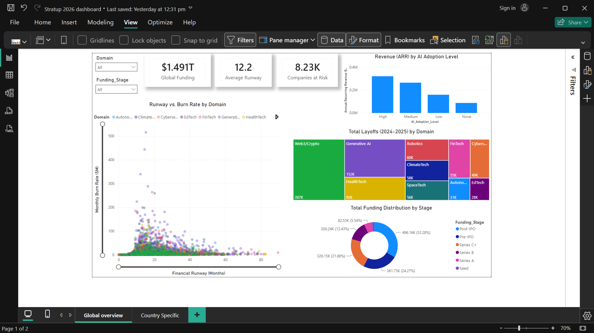
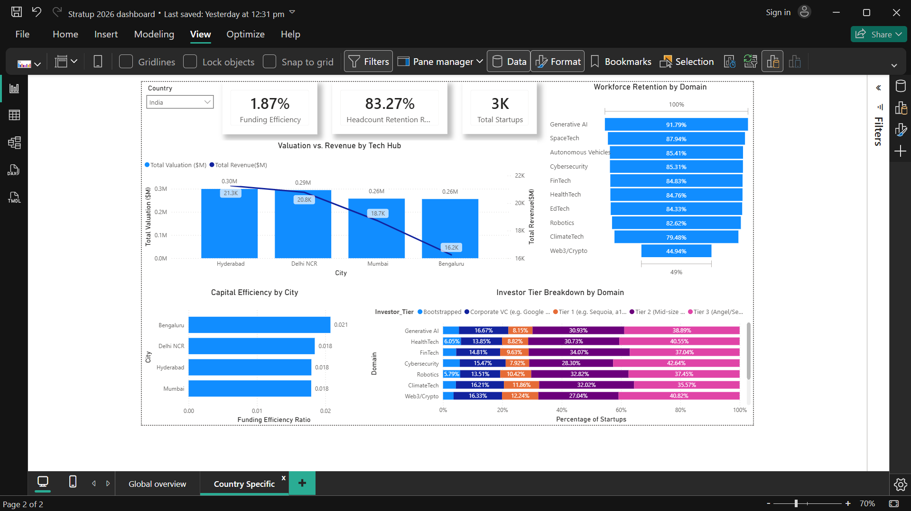

# Tech-Startup-Financial-Analysis
# Global Tech Startup Financial Analysis 2026

## Project Objective
This project evaluates the financial sustainability, capital efficiency, and workforce retention of tech startups. The analysis aims to identify which sectors are at critical risk of cash burn and rank regional tech hubs (specifically within the Indian market) based on funding-to-revenue efficiency.

## Dashboard Preview

### Global Financial Overview

### Regional Performance & Efficiency

## Tech Stack
* **Data Extraction & Transformation:** MySQL (CTEs, Window Functions, Complex JOINs)
* **Data Visualization:** Power BI

## Repository Architecture
* **`/data/`**: Contains the core `global_tech_startups_2026.csv` dataset (or data dictionary if the raw file is excluded due to size constraints).
* **`/sql/Creation and loading fie stratup db.sql`**: Initial schema definition and raw data ingestion.
* **`/sql/Data Normalisation.sql`**: Data modeling script that normalizes the flat file into a star schema containing `vw_Dim_Company`, `vw_Dim_Location`, `vw_Fact_Financials`, and `vw_Fact_Headcount` views to optimize analytical querying.
* **`/sql/Ad_hoc SQL problems.sql`**: Contains seven complex queries executing the core business logic, including runway sustainability risk assessments, capital efficiency rankings, and funding stage pivot tables.
* **`/dashboard/Stratup 2026 dashboard.pbix`**: The final interactive Power BI file.

## Key Business Insights
1. **Capital Efficiency by Hub:** Calculated the funding efficiency ratio (Total Funding / ARR) for major Indian cities to identify the most capital-efficient environments for investment. 
2. **Runway Sustainability:** Quantified the percentage of startups operating in the "Danger Zone" (under 6 months of financial runway) grouped by sector.
3. **AI Adoption vs. Retention:** Analyzed workforce stability by comparing the peak 2023 headcount against the current 2026 headcount, segmented by AI adoption levels.
4. **Resilient Survivors:** Identified specific startups that maintained late-stage funding (Series C+ or Pre-IPO) despite executing severe layoffs (over 30% of peak workforce).
